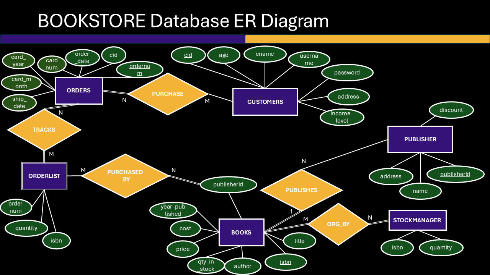

# Bookstore Database – SQL Schema & Basic Queries

**A normalized relational database schema with foundational SQL queries** for a bookstore management system.

[](https://www.postgresql.org/)
[](https://www.mysql.com/)


## Project Objective

Designed and implemented a fully normalized relational database for a bookstore to manage customers, orders, books, inventory, and publishers. This project focuses on proper database design and writing clear, foundational SQL queries for day-to-day operations and basic reporting.

## Key Features

- Fully normalized schema (3NF) with proper primary keys, foreign keys, and constraints
- Realistic sample data
- Basic SQL queries covering common operations (filtering, joins, aggregations, sorting)
- Complete Entity-Relationship Diagram (ERD) and Data Dictionary

## Repository Structure

```bash
bookstore-database-sql/
├── schema/
│   └── 01_create_schema.sql          # Table creation (normalized)
├── inserts/
│   └── 01_insert_data.sql            # Sample data population
├── queries/
│   ├── 01_basic_queries.sql
├── ERD/
│   └── bookstore_erd.png
├── docs/
│   └── data_dictionary.md
├── README.md
└── LICENSE
```

## How to Use
1. Run `schema/01_create_schema.sql` to create the database tables
2. Run `inserts/01_insert_data.sql` to populate sample data
3. Explore the analytical queries in the `queries/` folder
4. Explore the [Data Dictionary](docs/data_dictionary.md)

## ERD


## Conclusions

This project demonstrates the design of a normalized relational database and the development of basic SQL queries to interact with it. The schema supports core bookstore operations, and the queries allow retrieval of information such as customer orders, book inventory, and sales summaries.

## Future Enhancements

- Expand with more advanced analytical queries (CTEs, window functions, subqueries)
- Create database views for recurring reports
- Add indexing and query performance considerations
- Implement triggers and stored procedures
- Connect the database to a front-end application

## License
This project is licensed under the [MIT License](LICENSE).
